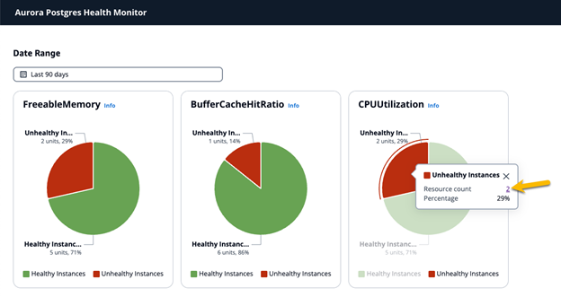
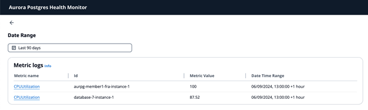
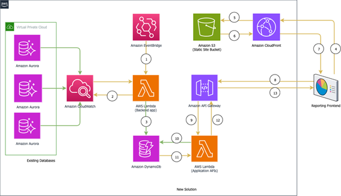

# Introduction

[Amazon Aurora PostgreSQL](https://aws.amazon.com/rds/aurora/) is a managed relational database service that combines the performance and availability of commercial databases with the simplicity and cost-effectiveness of open-source databases. Built on a fully distributed, fault-tolerant, and self-healing storage system, Aurora PostgreSQL is ideal for high-performance applications.

Monitoring the health of Aurora PostgreSQL instances is crucial for maintaining optimal performance, ensuring reliability, and preventing potential issues before they impact your applications. However, monitoring a large deployment of Amazon Aurora PostgreSQL instances poses significant challenges, particularly when resources are limited. The sheer volume of data and the complexity of managing thousands of instances make manual health checks impractical for a small team of database administrators (DBAs). Administrators need a comprehensive view of the overall health of the fleet, identifying how many instances are healthy and how many are not. They also need to collect performance data over extended periods to identify persistent issues. An automated, scalable, and streamlined monitoring solution that assists them in focusing on specific issues with unhealthy instances is needed.

In this project, we automated and streamlined the monitoring tasks for large-scale deployments by leveraging AWS managed services for scalability and efficiency. Users can define their own standards for what constitutes an “unhealthy” instance and configure the observing period to establish historical trends over time. Summary reports and visuals provide an overall view of the general status of the entire fleet. By logging the performance data for the potentially “unhealthy” instances into our system tables, users can focus on a smaller subset of instances, dive into the details of the findings, and use the built-in troubleshooting guide as a reference. All of this makes troubleshooting much easier to handle, significantly reducing the overall monitoring effort for customers with large fleets of databases.

# Project Outcome
## Main View


## Detailed View


## Solution Architecture


## Deployment

### Prerequisites
- An [AWS Account](https://aws.amazon.com/account/).
- An IAM user with permissions to deploy [AWS CloudFormation](https://aws.amazon.com/cloudformation/) templates, install [AWS CDK](https://docs.aws.amazon.com/cdk/v2/guide/home.html) and [AWS CLI](https://docs.aws.amazon.com/cli/) and set up RDS.
- A fleet of Aurora PostgreSQL clusters with each instance configured with [Aurora PostgreSQL logs published to Amazon CloudWatch Logs](https://docs.aws.amazon.com/AmazonRDS/latest/AuroraUserGuide/AuroraPostgreSQL.CloudWatch.html#:~:text=For%20Aurora%20PostgreSQL%2C%20the%20PostgreSQL%20log%20%28postgresql.log%29%20is,export%20feature%20for%20your%20Aurora%20PostgreSQL%20DB%20cluster.). The project outcome visuals are derived from a setup to monitor 7 Aurora PostgreSQL clusters.
- You also need to define which metrics to monitor. You can monitor both cluster level and instance level metrics listed in the [documentation](https://docs.aws.amazon.com/AmazonRDS/latest/AuroraUserGuide/Aurora.AuroraMonitoring.Metrics.html#Aurora.AuroraMySQL.Monitoring.Metrics.clusters) based on the observability requirements. For demo purpose, we choose the following three instance level metrics:

  •	BufferCachehitRatio (%)

  •	CPUUtilization (%) 

  •	FreeableMemory (bytes) 

In the solution, you have the option to define the values of below measures. An instance will only be reported as “unhealthy” when all the conditions are met. 
•	Metrics name: the instance metric we monitor 
•	Threshold: Specific value for the metric 
•	Metric Interval: The duration of time over which a metric data point is collected and aggregated. For example: one hour
•	Statistics: type of statistics of a metric. For example: Minimum

In this project, the default metric setup to check the health of a database instance is BufferCachehitRatio at a minimum of 90%, CPUUtilization	at a maximum of 80%, FreeableMemory	at a minimum of 2 GB.

### Deploy
- Clone this repository and install the component dependencies using the below commands:
```
git clone https://github.com/aws-samples/monitoring-aurora-postgresql-health-large-scale-deployments.git
cd web
npm install 
cd ..
cd server
npm install
```
- Deploy using following command:
```
cd server
sourceIp=PUBLIC_IP_GOES_HERE npm run deploy
```
Replace `PUBLIC_IP_GOES_HERE` value with the public IP of your machine. This makes sure that the API gateway is only accessible from your machine and not publically accessible. You can retrieve your public IP using a tool like [whatsmyip](https://whatsmyip.com/).

After the deployment is successful, you can use the URL from the output to launch the application. 
Note that the solution captures the metrics for the databases every hour by default and will monitor the Aurora PostgreSQL database instances only. 

### Performance Analysis and Tuning Recommendations

#### High CPU Utilization:
Scenario: An Instance is Reported with High CPU utilization
Symptom: CloudWatch metric CPUUtilization reports CPU utilization above the threshold defined.
<br>Possible Causes:
1.	Compare the following metrics with CPUUtilization (for the peak times) to identify the possible causes behind the issue: \
•	WriteIOPS \
•	ReadIOPS \
•	ReadThroughput \
•	WriteThroughput \
Increase in the IOPS and throughput may indicate sudden increase in database activity that may be caused by increased application load.

3.	A high CPU consuming OS process can also cause this issue. Top CPU consuming processes can be viewed from OS process list (available from the console in the database Monitoring screen on the console).

4.	A SQL that is using lot of resources (CPU/memory/IOPS) can also cause this issue. The top SQLs should be verified in the Performance Insights Top SQL screen.

5.	A high number of idle connections can also take up CPU resources.
   
<br>Recommendations:
1.	Tune the SQLs causing heavy activity in the system. Sometimes a simple index can reduce the overall IO activity and hence the CPU utilization.
2.	Monitor idle connections. Implement client-side and server-side connection pooling (Amazon RDS Proxy) tools.
3.	Upgrade the server to a larger instance to gain more CPUs.

#### FreeableMemory
Scenario: An Instance is Reported with Low Memory
Symptom: CloudWatch metric FreeableMemory stays low for the period of observation.
<br>Possible Causes:

1.	Memory parameters are configured too high. Check non-default settings on these parameters:\
•	shared_buffers\
•	work_mem\
•	maintenance_work_mem\
•	autovacuum_work_mem\
•	logical_decoding_work_mem

2.	Too many idle connections. FreeableMemory stays flat at a low level consistently with low database load.

3.	Large memory-consuming processes. FreeableMemory fluctuates with database workload changes. Investigate top OS processes/queries at specific time frames when FreeableMemory sharply declined.
   
<br>Recommendations:
1.	Set shared_buffers at no more than 75% of the server memory; Set the other OS process memory parameters small to start with. Adjust them bit by bit to observe the server response.
2.	Monitor idle connections. Implement client-side and server-side connection pooling (Amazon RDS Proxy) tools.
3.	Identify the top memory-consuming processes and tune them.
4.	Upgrade the server to a larger instance to gain more memory.

#### BufferCachehitRatio 
Scenario: An Instance is reported with Low Buffer Cache Hit Ratio
Symptom: CloudWatch metric BufferCachehitRatio stays lower than the threshold defined during the period of observation.\
<br>Possible Causes:
1.	High amount of IOs matching the low value of this metric. Check the following values for the instance and the database parameters:\
•	FreeableMemory metric\
•	CPUUtilisation metric\
•	shared_buffers – insufficient database parameter
2.	Top SQLs by waits in the Performance Insights. Check a process/SQL that is using lot of memory resources or doing a lot of IO operation.
3.	Large memory-consuming processes. FreeableMemory fluctuates with database workload changes. Investigate top OS processes/queries at specific time frames when FreeableMemory sharply declined.
   
<br>Recommendations:
1.	Upgrade the server to a larger instance to gain more memory 
2.	Tune top SQLs with large disk IOs.
3.	Increase the value of shared_buffers parameter to assign more memory to the database instance for caching data.


## Cleanup
You can clean up using this command:
```
cd server
cdk destroy --all
```
